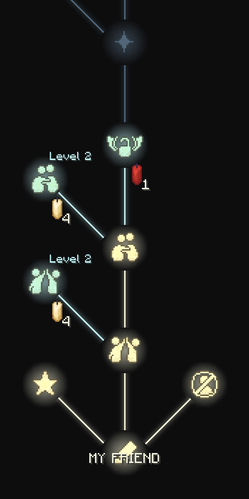
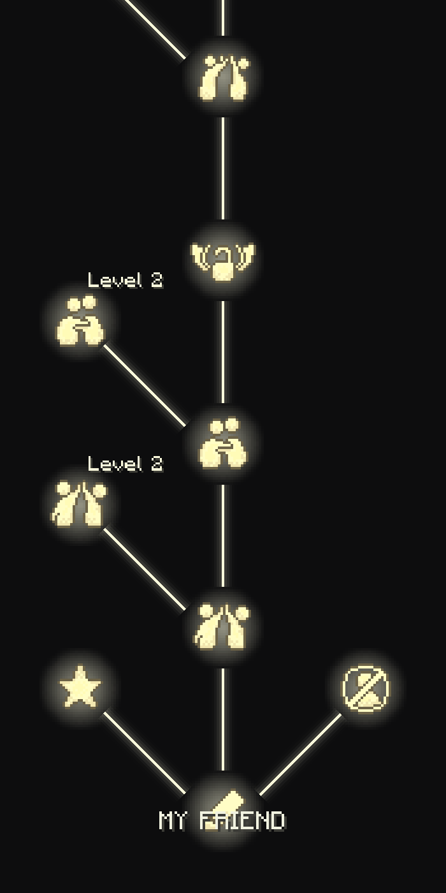
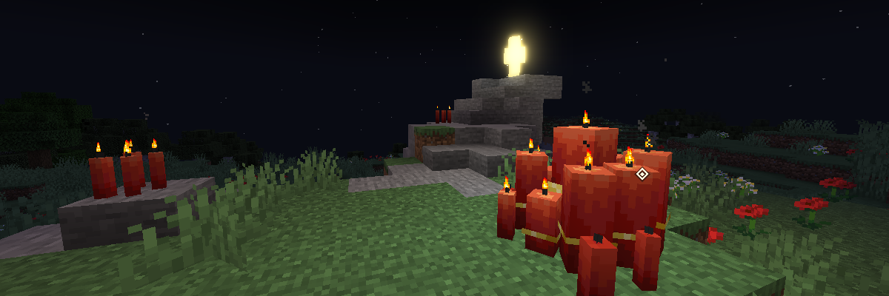

# ThatSkyInteractions
## Overview

**ThatSkyInteractions** is an *experimental Minecraft mod* that introduces the **non-competitive social interaction system** inspired by the game *Sky: Children of the Light* into the Minecraft world.  
This project serves as a **research prototype** for the topic:

> *“Can non-competitive player interactions mitigate the effects of game toxicity?”*

This mod explores how cooperative, emotionally expressive interactions might reshape the way players communicate and connect in multiplayer environments.

---

## Features

### Interaction Tree

Players can open the **Interaction Tree** interface by pressing the *interaction hotkey* while empty-handed and right-clicking another player.  
This interface faithfully recreates the friend system from *Sky: Children of the Light*.

Each node in the tree represents a **unique interaction**, including:
- Emotional actions and gestures
- Utility options like **blocking** or **renaming** other players
- Unlockable features requiring **mutual consent** between both players

Interactions must be mutually confirmed before being executed.  
Nodes are gradually **unlocked** by spending candles or red candles.

<table>
  <tr>
    <td>
      
    </td>
    <td>
      
    </td>
  </tr>
</table>

---

### Building Blocks


This part was originally created for the **TeaCon Jiachen** exhibition venue.  
While available in the mod, it is primarily for **creative mode use only**.

#### Candles
This mod introduces **16 types of customizable candles** that can be freely arranged within a single block space.  
Each candle has its own **style, position, and state**, unlike vanilla Minecraft candles which are limited in placement and count.

> Performance Note: The candle system has been heavily optimized for rendering efficiency, so it runs smoothly even with many candles in view.

#### Wing of Light
A shimmering, bloom-lit player decoration inspired by the *Sky* aesthetic — bringing a glowing.

---

### Astrolabe (WIP)

The **Astrolabe** is an upcoming system that allows players to open a **friend overview interface** via a hotkey.  
From there, you’ll be able to view your connected friends and potentially navigate to them in the future.


---

## Data-driven Design

ThatSkyInteractions supports user-defined interactions through Minecraft datapacks.  
You can add your own **interaction animations** to the interaction tree by editing this [file](./src/main/resources/data/thatskyinteractions/interact_trees/friend.json)

<details>
<summary>Example Interaction Tree</summary>

```json5
{
  "root": "root",                                  // the root node
  "nodes": [                                       // the node definitions
    {
      "id": "root",                                // node id, should be unique
      "type": "friend",                            // suggestion: root node should use "friend" as type
      "price": 3,                                  // unlock price
      "left": "like",                              // the node at the left branch
      "middle": "high_five_1",                     // the node at the middle branch
      "right": "block"                             // the node at the right branch
    },
    {
      "id": "high_five_1",
      "type": "interaction",                        // interaction node
      "price": 1,                                   // unlock price
      "interact": "thatskyinteractions:high_five",  // interaction animation id (SimpleAnimator format)
      "left": "high_five_2",
      "middle": "hug_1"
    },
    {
      "id": "lock_1",
      "type": "lock",                               // lock node, will use red candle instead of regular candle
      "price": 1,
      "middle": "double_high_five_1"
    },
    // ...
  ]
}
```

</details>

---

## Research Background

The creation of **ThatSkyInteractions** is part of an experimental study on **non-competitive game design**.  
The key question it explores:

> *“Can the introduction of cooperative, emotionally expressive interaction systems reduce toxic behaviors in online multiplayer games?”*

By adapting the *Sky*-style friend system into Minecraft, the project aims to demonstrate how empathy-driven design elements may promote a healthier, more positive gaming community.

---

## TODO

### Content & Features
- Modify rendering shaders for better interaction visuals
- Add **single-player interaction animations** and improve data-driven logic

### Data-driven System
- Refactor the **interaction tree registration system** to support modular node definitions

### Dependencies & Architecture
- Gradually migrate animation handling from **SimpleAnimator** to **Animata4J**
- Separate non-interaction and non-animation content into a standalone mod: **HeartFire**

---

## Credit
Developer/Animator/Artist: LouisQuepierts

Inspired by *Sky: Children of the Light* by thatgamecompany.  
All design references are used for educational and non-commercial purposes.

Attended TeaCon Jiachen (https://www.teacon.cn/jiachen/)